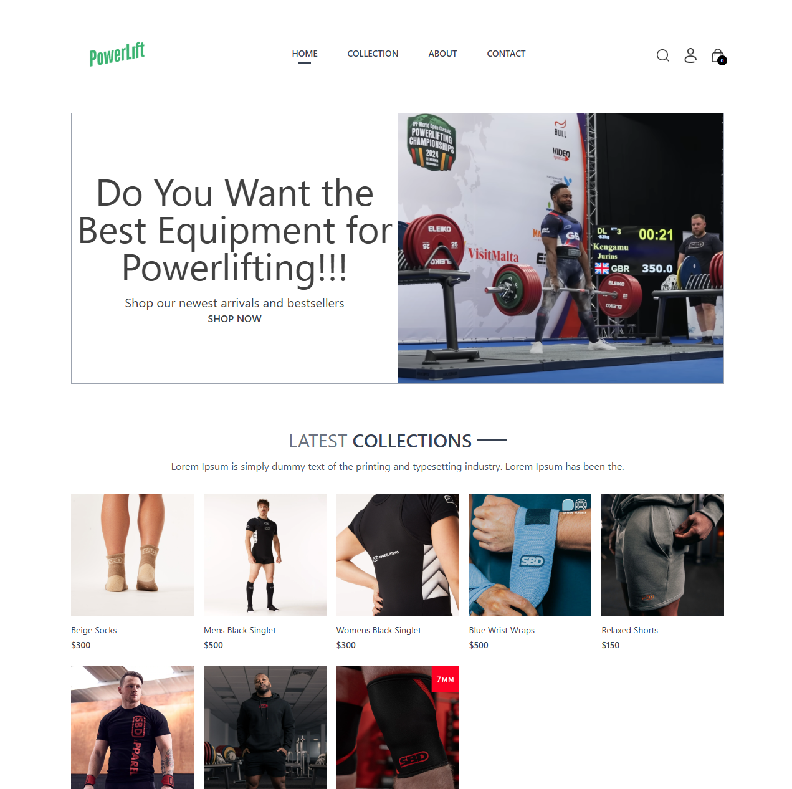
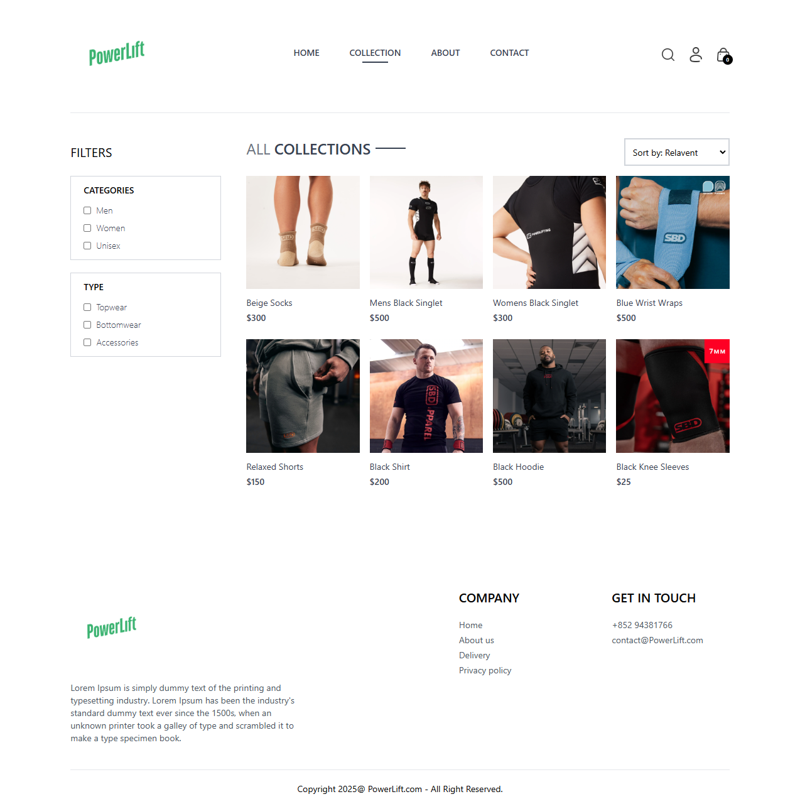
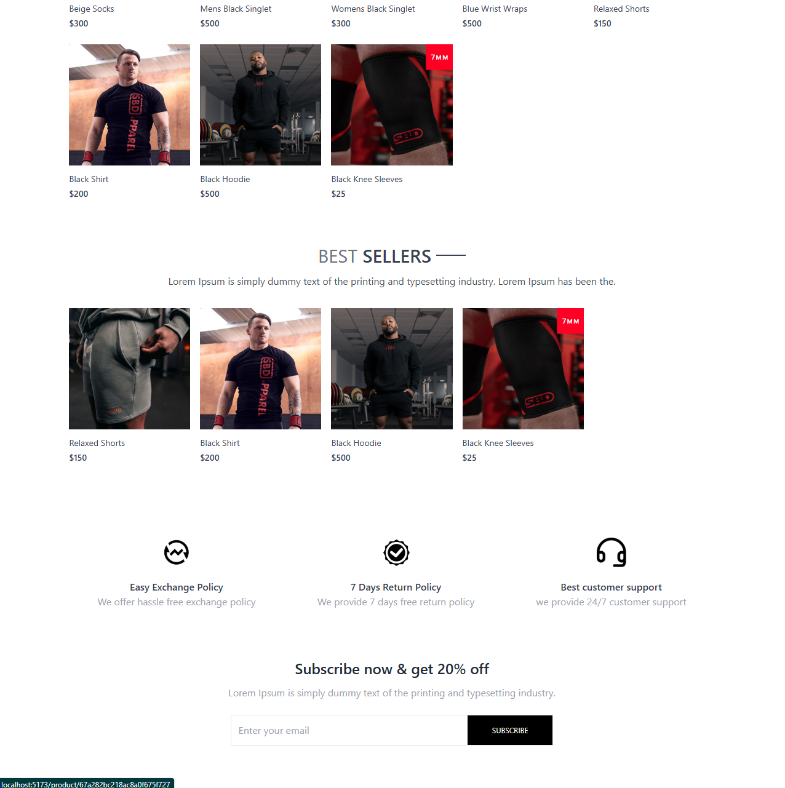
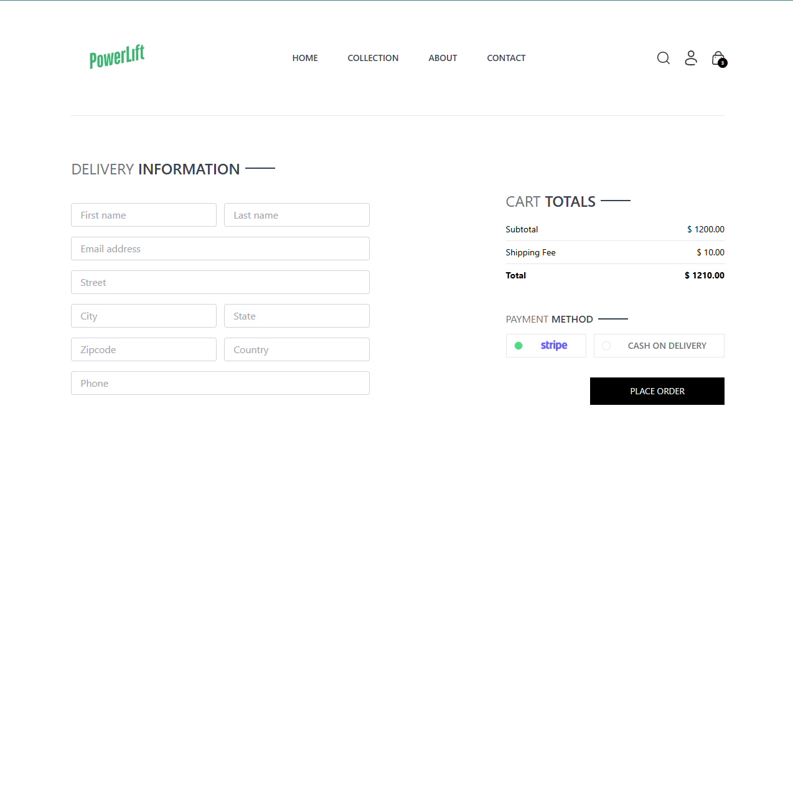

# PowerLift  
**E-Commerce Platform with MERN Stack & Stripe Integration**  

**Live Demo**:
- Page: https://powerlift-ecommerce-frontend.onrender.com/
- Admin: https://powerlift-ecommerce-1.onrender.com/

Admin Email: admin@example.com
Pass: secret :))


---



## Description  
A full-stack e-commerce platform enabling users to browse products, manage carts, and complete secure payments via Stripe. Built with:  
- **MongoDB**: Product/order data storage  
- **Express.js & Node.js**: Backend API  
- **React**: Dynamic frontend with responsive design  
- **Stripe**: Payment processing (test mode)

Key objectives:  
- Demonstrate scalable MERN architecture  
- Implement modern payment workflows   
- Provide intuitive user experience
- Overall just a good practice on fullstack development :)

---

## Features  
**User-Facing**:  
- Product search/filtering with real-time updates
- 
- Cart management (add/update/delete items)
  
- Multi-step checkout with Stripe integration
- 
- Order history tracking   

**Admin Features**:  
- Product upload/management dashboard   
- Order fulfillment interface   
- Authentication/authorization 


---

## Installation  
```bash
# Clone repository
git clone https://github.com/your-username/ecommerce-mern

# Install dependencies
cd frontend && npm install
cd backend && npm install
cd server && npm install

# Configure environment variables
Create .env files with:
JWT_SECRET = 
ADMIN_EMAIL = "admin@example.com"
ADMIN_PASSWORD = secret

MONGODB_URI 

CLOUDINARY_API_KEY 
CLOUDINARY_SECRET_KEY = 
CLOUDINARY_NAME = 

STRIPE_SECRET_KEY = 

# Start development servers
cd frontend
- npm run dev
cd backend
- npm run server
cd admin
- npm run dev
```

---

## Payment Testing  
Use Stripe test credentials:  
- **Card Number**: 4242 4242 4242 4242  
- **Exp Date**: Any future date  
- **CVC**: Any 3 digits  

---

## Deployment  
1. Build React app: `npm run build`  
2. Deploy frontend to Vercel   
3. Host backend on cloud service (e.g., Render)  
4. Configure production environment variables  

---

## Technology Stack  
**Frontend**:  
- Vite
- Tailwind   

**Backend**:  
- Express.js
- MongoDB Atlas
- JWT (authentication)   

**DevOps**:  
- Vercel (frontend hosting)   
- CI/CD pipeline (automated deployments)  

---

## Future Enhancements  
- Product review/rating system  
- Advanced analytics dashboard

---


